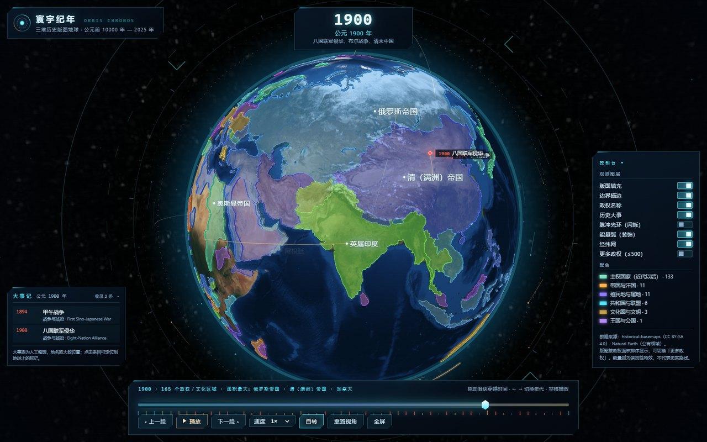
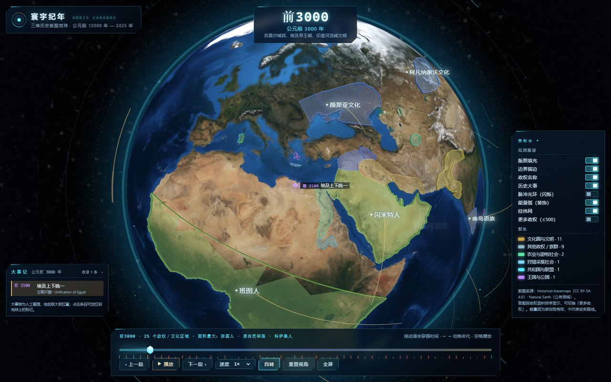
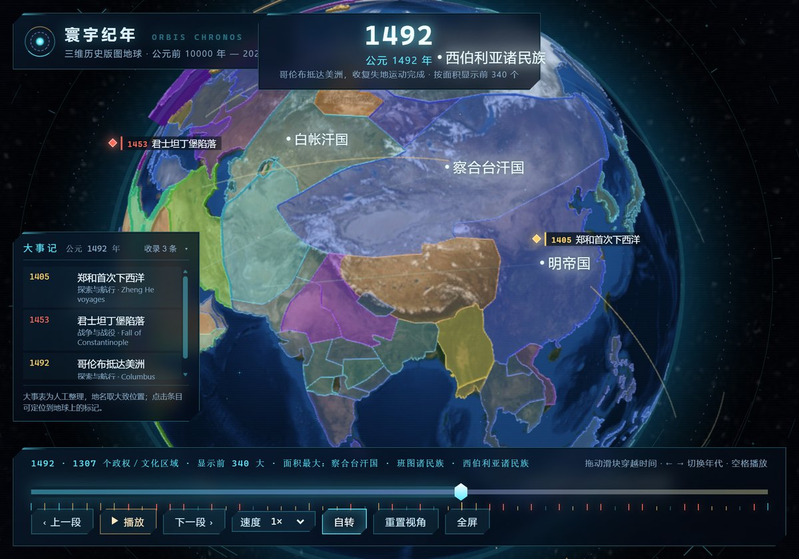
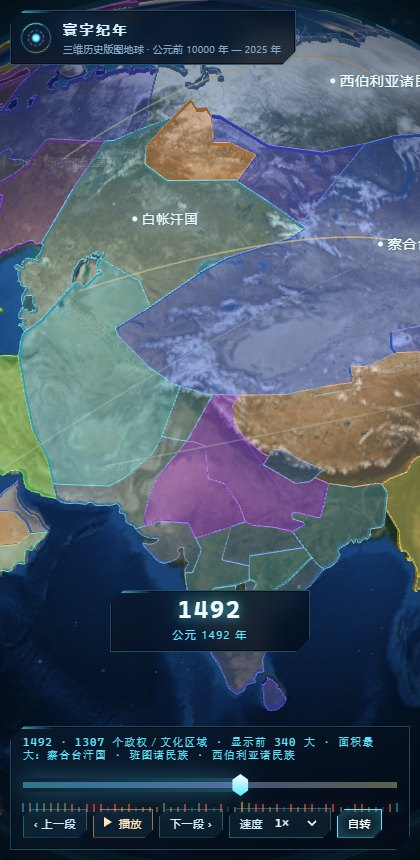

# 寰宇纪年 · ORBIS CHRONOS

**中文** | [English](README.en.md)

一个科幻风格的三维历史版图地球：在真实地球贴图上按年代显示各国／各政权的疆域，
拖动时间轴即可穿越公元前 10000 年至 2025 年，版图以升起／沉入动画平滑过渡，
并把战争、条约、王朝更替等历史大事标在球面上。



| 历史大事与年代标注 | 近景与政权标签 | 手机端 |
| --- | --- | --- |
|  |  |  |

```
双击 启动.cmd        即可以本机浏览器打开（默认 http://127.0.0.1:3180/）
```

需要 Node.js 18+（仅用于本地静态服务器，页面本身不需要 Node）。
纯静态站点，可直接部署到 GitHub Pages / Cloudflare Pages / Netlify，
不需要任何后端或数据库。

**快速开始（命令行）**

```bash
git clone https://github.com/void-space912/orbis-chronos.git
cd orbis-chronos
npm start            # = node scripts/serve.mjs 3180
# 浏览器打开 http://127.0.0.1:3180/
```

---

## 一、它能做什么

| 功能 | 说明 |
| --- | --- |
| 三维地球 | 真实 NASA Blue Marble 贴图 + 地形凹凸 + 海面高光 + 大气辉光，可自由旋转、缩放 |
| 时间轴 | 54 个年代快照（前 10000 年 → 2025 年），滑块 / 键盘 / 自动播放三种方式穿越 |
| 版图动画 | 切换年代时旧版图下沉、新版图从地表升起（`polygonsTransitionDuration`），年份读数带数字滚动特效 |
| 历史大事 | 94 条人工整理的大事（战争 39 · 王朝兴替 20 · 文化科技 13 · 条约 8 · 革命 7 · 探索 6 · 灾害 1）：在地球上打标记、在左侧列出，点击条目即可定位过去 |
| 政权交互 | 悬停高亮 + 悬浮信息卡；点击聚焦并弹出档案卡片：分类、数据集类型、版图占比、本年代面积排名、近似中心坐标、存在年代跨度、归属，以及本年代收录的大事（可点）与外部延伸资料链接 |
| 科幻界面 | 全息面板、扫描线、暗角、经纬网、环绕轨道刻度环、星尘与流线粒子（2D 画布特效层），整体克制不抢地图 |
| 图层开关 | 版图填充、边界描边、政权名称、历史大事、脉冲光环（默认关）、能量弧（装饰）、经纬网、更多政权、隐藏巨型区域 |
| 深链 | 地址栏 `#y=1900`、`#y=bc1000`、`#y=2025` 可直达某个年代 |

## 二、数据来源（都是真实数据，可追溯）

| 数据 | 用途 | 来源 | 许可 |
| --- | --- | --- | --- |
| historical-basemaps | 前 10000 年 — 2010 年的 53 个世界政权版图快照 | <https://github.com/aourednik/historical-basemaps> | CC BY-SA 4.0 |
| Natural Earth 110m admin-0 countries | 2025 年现代国家 | <https://github.com/nvkelso/natural-earth-vector> | 公有领域 |
| three-globe 示例贴图 | Blue Marble 地表、地形、海面、星空 | <https://github.com/vasturiano/three-globe> | MIT / NASA 影像 |
| globe.gl 2.46.2 | 三维地球渲染引擎 | <https://github.com/vasturiano/globe.gl> | MIT |
| `data/events.json` | 94 条历史大事（战争/条约/王朝/探索…） | **本项目人工整理**，非数据集自带 | 随本项目 |

所有第三方运行时资源都已固化在 `vendor/`，页面运行时**不访问外部 CDN**，离线可用。

### 数据处理与取舍（重要）

- 坐标统一四舍五入到小数点后 3 位（约 100 米级），用于压缩体积；原始数据精度本身低于此。
- 同名要素（同一政权被拆成多个 Feature）已合并。
- 面积按经纬度多边形估算，仅用于排序与占比展示，不是精确测绘面积。
- 页面默认只绘制**面积最大的前 300 个**政权（`更多政权` 开关可放宽到 500 个），
  因为 1492、1600 等快照包含上千个细小领地；时间轴下方会写明「显示前 N 大」。
- 现代层依据中国官方立场，将台湾要素与中国的几何合并为一个要素。
- 英文政权名的中文译名为本项目补充（`js/i18n.js`），未收录的名称保留原文；
  年代说明文字（如「柏林会议」）是本项目撰写的时间锚点，不是数据集自带字段。
- `data/events.json` 的大事表同样是**本项目人工整理**的：年份取公历（负数表示公元前），
  地点取大致城市/战场位置（度级精度，仅用于在地球上定位），每条的 `note` 是一句背景说明。
  它只收录了 94 条代表性事件，不是完整史表；事件按「上一个快照之后 ~ 本快照」的区间归入年代。
- **历史疆界本身存在学术争议**，historical-basemaps 为开源整理数据，请勿用于测绘或法律用途。

## 三、目录结构

```
historical-globe/
├── index.html            页面结构（HUD / 时间轴 / 控制台 / 载入遮罩）
├── css/style.css         科幻界面样式（含响应式与 reduced-motion 适配）
├── js/
│   ├── app.js            主程序：地球初始化、图层、年代切换、交互、界面绑定
│   ├── data.js           年代数据加载、缓存、配色与锚点预处理
│   ├── eras.js           54 个年代定义（年份、中文标注、史实锚点说明）
│   ├── events.js         历史大事表：加载、按年代切片、类型与配色
│   ├── i18n.js           政权中文译名、type 翻译、分类与配色映射
│   └── effects.js        2D 特效层：星尘、环绕粒子、HUD 刻度环、跃迁闪光
├── vendor/               globe.gl + 地球贴图（已固化版本，附 VERSIONS.json 校验值）
├── data/
│   ├── eras/*.json       53 个历史年代版图（紧凑格式）
│   ├── modern.json       2025 年现代国家
│   ├── events.json       94 条历史大事（人工整理）
│   ├── name-index.json   政权名 → 出现年代索引（用于「存在年代」）
│   ├── manifest.json     数据清单（数量、体积、来源）
│   └── name-report.json  政权名频次与面积占比报告（译名整理依据）
└── scripts/
    ├── serve.mjs         本地静态服务器（gzip + 缓存头）
    ├── build-data.mjs    从上游抓取并生成 data/（可重复运行，SKIP_EXISTING=1 跳过已有）
    ├── build-index.mjs   生成 name-index.json
    ├── fetch-assets.mjs  固化第三方运行时资源到 vendor/
    ├── optimize_textures.py  把原始贴图压成页面实际使用的 vendor/img/*.jpg
    ├── check.mjs         静态自检：年代完整性、事件表、资源引用、DOM id 一致性
    ├── verify.mjs        浏览器端验收：截图、交互、事件、播放帧时间（需调试端口浏览器）
    ├── perf.mjs          首屏性能测量：冷启动 / 热启动 / 换年代耗时
    ├── tune.mjs          播放流畅度实测：每一步的数据耗时 + 帧时间
    ├── measure-data.mjs  离线量测：解析耗时、环数/顶点数与面积阈值的影响
    ├── texcheck.mjs      贴图分层对比截图（判断画面方块来自哪张贴图）
    └── diagnose.mjs      浏览器端诊断：特效画布、绘制调用、标签渲染
```

## 四、常用命令

```powershell
# 启动站点（默认 3180 端口）
node scripts/serve.mjs 3180

# 重新生成数据（首次已生成，data/ 已随项目提供）
node scripts/build-data.mjs            # 全量抓取
$env:SKIP_EXISTING=1; node scripts/build-data.mjs   # 只用已有文件重建清单

# 生成名称索引
node scripts/build-index.mjs

# 固化第三方资源（原始贴图存 vendor/img/_source/）
node scripts/fetch-assets.mjs

# 压缩贴图到页面实际使用的 vendor/img/*.jpg
python scripts/optimize_textures.py --force

# 静态自检
node scripts/check.mjs

# 浏览器验收（需先启动带调试端口的浏览器）
node scripts/verify.mjs 1900 1500 bc1000 2025
node scripts/perf.mjs        # 首屏冷/热启动
node scripts/tune.mjs        # 播放时的每步耗时与帧时间
node scripts/measure-data.mjs 1900 1492   # 纯数据侧耗时
```

## 五、首屏性能（2026-09-24 实测并优化）

第一版冷启动偏慢，原因和现在的处理：

| 原因 | 处理 | 效果 |
| --- | --- | --- |
| 四张贴图原始体积 3.03 MB（白天贴图 4096×2048 单张就 1.43 MB） | `scripts/optimize_textures.py`：白天贴图降到 2048×1024 / q90 / 4:4:4；凹凸图与海面高光先轻微模糊再压 | 3.03 MB → 0.86 MB |
| 星空、凹凸、海面高光都要在首屏等 | 首屏只等「地球贴图 + 当前年代数据」，其余在露出画面后补载（`enhanceTextures()`） | 关键路径再少 0.30 MB |
| 关键资源串行发现（先下 JS，才知道要下贴图） | `<head>` 里 `preload` 地球贴图与引擎，内联脚本按 `#y=` 预载即将显示的年代数据 | 并行下载 |
| 首屏就预取前后 4 个年代（≈0.75 MB）抢带宽 | 改成浏览器空闲时先取 ±1，再取 ±2 | 首屏不被抢占 |
| 每次打开都重新下载 | `vendor/` 发 `immutable`（1 年），`data/` 1 小时 + ETag | 二次打开 0 字节传输 |

实测（本机 headless Edge + 软件渲染，真机更快）：

- **冷启动**：首屏关键传输 ≈ **1.23 MB**（引擎 514 KB + 贴图 534 KB + 版图 183 KB + 代码 30 KB），
  从导航到「贴图与版图都可见」约 **1.0 s**。
- **热启动**（二次打开）：**0 字节**传输，约 **0.7 s** 出图。
- **切换到未缓存的年代**（如 1400 年）：约 **0.86 s**（含 JSON 解析与多边形三角化）。
- 复现：`node scripts/perf.mjs`（输出在 `verify/perf.json`），贴图对比图见 `verify/tex-a-all.png`。

后续还能再压的地方：引擎包 1.88 MB（gzip 514 KB）占了首屏一半，若换用 three.js 自建渲染可去掉大半，
但会失去 globe.gl 的疆域几何（反经线、孔洞处理）能力，暂不值得。

### 播放流畅度（同一轮优化）

播放时"一顿一顿"的根因是**每一步都在现场取数据**：`prefetchNeighbours()` 原来在播放中直接返回，
于是每切一个年代就要下载 + 解析 200 KB ~ 1.7 MB 的版图 JSON，恰好卡在动画中间。

| 处理 | 效果（`node scripts/tune.mjs` 实测） |
| --- | --- |
| 播放时改为**向前预取 +1/+2**，滑动时仍旧只用空闲预取 | 每一步的数据耗时从 30–200 ms 降到 **1–3 ms**（含 1492 这种 1.7 MB 的大快照） |
| 多边形样式的 accessor 只在初始化时设一次（原来每个年代重复 setter，等于每次重新消化全部多边形三遍） | 一次换年代只剩一次数据更新 |
| 默认显示数量 340 → **300**，`polygonCapCurvatureResolution` 5 → **6** | 绘制调用与三角面数同步下降 |
| 2D 特效层去掉逐帧字符串与渐变对象分配（星点颜色预算、粒子尾迹改直线） | 每帧 GC 压力明显下降 |
| 时间轴刻度只建一次，之后只切换状态 | 换年代不再重建 54 个 DOM 节点 |
| 播放中不做年份闪光 / 能量爆发，脉冲光环改为默认关闭 | 连续闪烁消失，观看更稳 |

### 巨型区域的淡显（观感修复）

跨洲帝国（俄罗斯帝国 19%、USSR 16%…）和环绕极点的"盖帽"（南极洲、北极海兽猎民）在
高不透明度下整片铺满可见半球，看起来像一层红/蓝色罩子扣在地球上。现在：

| 情况 | 处理 |
| --- | --- |
| 面积占比 ≥ 8% 的要素 | 填充不透明度按占比递减（`giantFactor(share)`），19% 的帝国只剩 **0.16** |
| 环绕极点的多边形（跨经度 > 300° 且位于高纬） | 额外再乘 0.42 → 约 **0.13**，几乎只剩一层极淡的色 |
| 巨型要素的侧壁与描边 | 侧壁不透明度 0.9 → **0.22**（不再形成硬壳边缘）；描边保留 0.72，疆域轮廓依旧清晰 |
| 想要完全看不到 | 控制台新增「**隐藏巨型区域**」开关，勾选后直接不绘制 |
| 悬停/点击 | 仍然给出满色高亮，交互反馈不受影响 |

另外把 2D 特效层里那圈贴边的蓝色微光和旋转的琥珀色扫描弧都压低了一半以上
（0.62 → 0.34、0.16 → 0.09），免得在地球边缘形成一条彩色光带。

## 六、交互说明

- **拖动滑块**：切换年代（跨年代时地图平滑过渡，年份数字滚动）- **← / →**：上一段 / 下一段年代；**空格**：播放 / 暂停；**R**：重置视角；**F**：全屏；**Esc**：关闭档案
- **悬停版图**：高亮并显示悬浮信息；**点击版图**：镜头聚焦 + 右侧档案卡片
- **档案卡片**：给出分类、数据集类型、版图占比、本年代面积排名、近似中心、存在年代跨度、归属，
  以及本年代收录的大事（点一下即可定位）与「中文维基检索 / 英文维基检索」等外部链接；
  数据里有原始资料链接时会额外显示「数据集原始链接」。所有链接都会校验为 http(s) 外链——
  数据缺链接时用维基检索兜底，绝不出现点了没反应或跳回本页的假链接。
- **大事记**：点击左侧条目 → 镜头飞到该事件位置，球面上的红色菱形标记会闪两下
- **自转**：开启后地球缓慢自转；**速度**：播放速度 0.5× – 4×

## 七、已知限制

- historical-basemaps 的年代是离散快照（如前 1000 年、前 700 年），没有逐年数据，
  因此拖动滑块是在快照之间**切换**，过渡动画把「替换」表现为「升起／下沉」，并非逐年插值。
- 深层年代的要素多是文化圈与考古学文化（如「颜那亚文化」），不是现代意义上的国家。
- 千年尺度上部分边界只有行政区轮廓级精度，放大到近景会看到折线。
- 主要开销在多边形绘制调用上（1900 年约 2250 次 draw call，环数越多调用越多），
  集成显卡或手机端建议关闭「边界描边 / 更多政权」，并把播放速度降到 0.5×。
- 大事表只有 94 条代表性事件，且地点是度级精度的"大致位置"，不是精确坐标；
  事件按「上一个快照之后 ~ 本快照」归入年代，所以有些年代会显示"暂无收录"。
- 贴图已压缩（2048×1024）：把地球放到最大时，地表细节不如原始 4096 贴图锐利；
  想要原图执行 `node scripts/fetch-assets.mjs` 取回 `vendor/img/_source/` 里的原图即可。

## 八、开源与授权

| 部分 | 许可 | 说明 |
| --- | --- | --- |
| 源代码（`index.html`、`css/`、`js/`、`scripts/`）与本项目撰写的文档、事件表、译名表 | **MIT** | 见 `LICENSE`，可自由使用、修改、商用，保留版权声明即可 |
| 派生于 historical-basemaps 的版图数据（`data/eras/*.json`、`data/manifest.json`、`data/name-report.json`） | **CC BY-SA 4.0** | 必须**署名 + 标明改动 + 相同方式共享** |
| Natural Earth 现代国界（`data/modern.json`） | 公有领域 | 无附加要求 |
| `vendor/` 内的 globe.gl、three-globe 贴图 | MIT（贴图源自 NASA 影像） | 见 `vendor/VERSIONS.json` |

**署名要求**（发布、转载、二次开发时请一并保留）：

> 版图数据来自 [historical-basemaps](https://github.com/aourednik/historical-basemaps)（CC BY-SA 4.0，作者 Andrei Ourednik），
> 现代国界来自 [Natural Earth](https://www.naturalearthdata.com/)（公有领域），
> 渲染使用 [globe.gl](https://github.com/vasturiano/globe.gl)（MIT），
> 由「寰宇纪年 · ORBIS CHRONOS」整理为分年代快照并做压缩处理。

完整清单、许可全文链接与改动说明见 **`THIRD-PARTY.md`**。

> 若你只想复用代码、不想承担数据的 CC BY-SA 义务：删掉 `data/` 目录，
> 用 `node scripts/build-data.mjs` 自行从上游重新生成，然后按你的方式授权这些数据。

### 部署到 GitHub Pages（让更多人直接体验）

仓库是纯静态的，根目录就是站点根目录，贴图与数据都在仓库里，**无需构建步骤**：

1. 新建 GitHub 仓库并推送本目录（`.gitignore` 已排除验收截图与贴图原图）：
   ```bash
   git remote add origin https://github.com/void-space912/orbis-chronos.git
   git push -u origin main
   ```
   （仓库需先在 GitHub 上创建；也可以 `gh auth login` 后一条命令建好并推送：
   `gh repo create orbis-chronos --public --source=. --remote=origin --push`）
2. 仓库 **Settings → Pages → Source** 选择 **GitHub Actions**（仓库内已附
   `.github/workflows/pages.yml`，推送到 `main` 即自动发布），
   几分钟后访问 <https://void-space912.github.io/orbis-chronos/>。
3. 也可以在 Cloudflare Pages / Netlify / Vercel 直接连仓库，构建命令留空、输出目录填 `/`。

> 首次访问约 1.2 MB（引擎 + 贴图 + 当前年代数据），之后的年代数据按需加载并缓存；
> 线上托管会自动 gzip，比本地 `serve.mjs` 更省流量（`serve.mjs` 只是本地方便调试用的）。

### 贡献

- 数据勘误、历史大事补录、译名修正：直接改 `data/events.json`、`js/i18n.js`、`js/eras.js`，
  然后跑 `npm run check`（会校验年代完整性、事件表字段、坐标范围、资源引用、DOM id 一致性）。
- 改完请顺带跑一次 `npm run verify`（需要本地浏览器 + 调试端口，见 `scripts/verify.mjs` 顶部说明）并附上截图。
- 提交信息建议用 `feat: / fix: / docs: / perf:` 前缀。
- 关于政治呈现：现代层按中国官方立场把台湾与中国合并为一个要素；
  历史层保留上游数据的原始边界。若你要在其他地区发布，建议在 README 中说明你的呈现方式。
